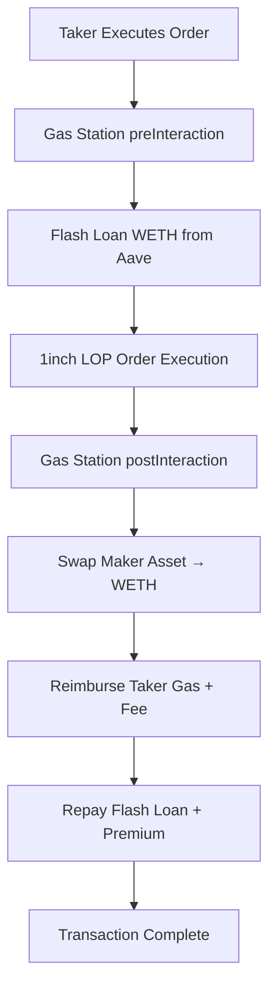

# Gas Station Extension

> **🚉 Gasless Trading for 1inch Limit Order Protocol**  
> Enable gasless limit order execution with automated WETH-based fee coverage

---

## Overview

The **Gas Station Extension** enables gasless trading on the 1inch Limit Order Protocol by automatically covering gas costs and fees through flash loans and token swaps. When a taker executes an order through the Gas Station, the extension:

1. **Flash borrows WETH** from Aave v3 to cover gas and fees
2. **Swaps maker assets** to WETH using 1inch Aggregator
3. **Reimburses the taker** with gas costs + fee
4. **Repays the flash loan** with premium

This creates a seamless gasless experience where takers can execute orders without holding ETH for gas.

---

## Architecture



### Key Components

- **🚉 Gas Station**: Core extension implementing `IAmountGetter`, `IPreInteraction`, `IPostInteraction`
- **⚡ Flash Loan Adapter**: Aave v3 integration for WETH borrowing via delegatecall
- **🔄 1inch Aggregator**: Real-time price discovery and token swapping
- **🏦 Aave v3 Pool**: Flash loan provider for WETH liquidity

---

## Features

### ✅ **Gasless Execution**

- Takers don't need ETH for gas - paid automatically from order proceeds
- Gas costs calculated dynamically based on current gas price
- Configurable gas stipend for reliable execution

### ✅ **Real-time Pricing**

- Integrates with 1inch Aggregator v6 for spot price discovery
- Fallback pricing mechanism for maximum reliability
- Supports all ERC20 tokens with WETH pairs

### ✅ **Flash Loan Optimization**

- Uses Aave v3 for minimal borrowing costs (0.05% fee)
- Precise accounting to minimize borrowed amounts
- Automatic repayment from swap proceeds

### ✅ **Flexible Fee Structure**

- Configurable taker fee (default: 1%)
- Gas reimbursement based on actual usage
- Transparent cost calculation

---

## Configuration

### Constructor Parameters

```solidity
constructor(
    uint256 takerFeeBps,        // Taker fee in basis points (100 = 1%)
    uint256 gasStipend,         // Gas allowance for execution (150,000)
    address aggregationRouter,  // 1inch Aggregation Router v6
    address weth,              // WETH token address
    address aavePool,          // Aave v3 Pool address
    address flashLoanAdapter   // Flash loan adapter address
)
```

### Network Addresses

#### Ethereum Mainnet

```javascript
const config = {
  takerFeeBps: 100, // 1%
  gasStipend: 150000, // 150k gas
  aggregationRouter: '0x111111125421cA6dc452d289314280a0f8842A65', // 1inch Router v6
  weth: '0xC02aaA39b223FE8D0A0e5C4F27eAD9083C756Cc2', // WETH
  aavePool: '0x87870Bca3F3fD6335C3F4ce8392D69350B4fA4E2', // Aave v3 Pool
};
```

#### Polygon

```javascript
const config = {
  takerFeeBps: 100,
  gasStipend: 150000,
  aggregationRouter: '0x111111125421cA6dc452d289314280a0f8842A65', // 1inch Router v6
  weth: '0x0d500B1d8E8eF31E21C99d1Db9A6444d3ADf1270', // WMATIC
  aavePool: '0x794a61358D6845594F94dc1DB02A252b5b4814aD', // Aave v3 Pool
};
```

---

## Usage Examples

### 1. Basic Order with Gas Station

```javascript
const order = {
  salt: '12345',
  makerAsset: '0x6B175474E89094C44Da98b954EedeAC495271d0F', // DAI
  takerAsset: '0xC02aaA39b223FE8D0A0e5C4F27eAD9083C756Cc2', // WETH (required)
  maker: '0x...',
  receiver: '0x0000000000000000000000000000000000000000',
  allowedSender: '0x0000000000000000000000000000000000000000',
  makingAmount: '1000000000000000000000', // 1000 DAI
  takingAmount: '500000000000000000', // 0.5 WETH

  // Gas Station integration
  makerTraits: encodeMakerTraits({
    allowedSender: false,
    shouldCheckEpoch: false,
    expiry: Math.floor(Date.now() / 1000) + 3600, // 1 hour
    nonceOrEpoch: 1,
    series: 0,
  }),

  // Pre-interaction: Flash loan setup
  preInteraction: gasStationAddress,

  // Post-interaction: Swap and reimbursement
  postInteraction: gasStationAddress,
};
```

### 2. Order Execution Flow

```javascript
// 1. Taker calls LimitOrderProtocol.fillOrder()
const fillTx = await limitOrderProtocol
  .connect(taker)
  .fillOrder(
    order,
    signature,
    interaction,
    makingAmount,
    takingAmount,
    skipPermitAndThresholdAmount
  );

// 2. Gas Station automatically:
//    - Flash borrows WETH for gas + fees
//    - Executes the order
//    - Swaps maker asset (DAI) to WETH
//    - Reimburses taker gas costs + fee
//    - Repays flash loan

console.log('✅ Gasless order executed successfully!');
```

### 3. Dynamic Amount Calculation

```javascript
// Get actual taking amount (includes gas costs)
const actualTakingAmount = await gasStation.getTakingAmount(
  order,
  '0x', // extension data
  ethers.ZeroHash, // order hash
  taker.address,
  order.takingAmount, // threshold
  order.makingAmount // remaining
);

console.log(`Taking amount: ${ethers.formatEther(actualTakingAmount)} WETH`);
// Output: "Taking amount: 0.51025 WETH" (includes ~0.01025 WETH for gas + fees)

// Get actual making amount (deducts gas costs)
const actualMakingAmount = await gasStation.getMakingAmount(
  order,
  '0x', // extension data
  ethers.ZeroHash, // order hash
  taker.address,
  order.makingAmount, // threshold
  order.makingAmount // remaining
);

console.log(`Making amount: ${ethers.formatEther(actualMakingAmount)} DAI`);
// Output: "Making amount: 989.75 DAI" (deducts costs from maker proceeds)
```

---

## Cost Structure

### Gas Costs Breakdown

```
Total Operation: ≤ 600k gas
├── preInteraction (flash loan):     ~150k gas
├── executeOperation (callback):     ~200k gas
├── 1inch swap execution:            ~150k gas
└── postInteraction (repayment):     ~100k gas
```

### Fee Structure

```javascript
// Example with 1000 DAI → WETH order at 20 gwei gas price
const costs = {
  gasReimbursement: gasStipend * gasPrice, // 150k * 20 gwei = 0.003 ETH
  flashLoanFee: borrowedAmount * 0.0005, // 0.05% of flash loan
  takerFee: borrowedAmount * (takerFeeBps / 10000), // 1% service fee
  totalCosts: gasReimbursement + flashLoanFee + takerFee,
};

// Taker receives: gas reimbursement + taker fee
// Flash loan: repaid from maker asset swap proceeds
```

---

## Integration Guide

### 1. Deploy Gas Station

```bash
# Using Hardhat Ignition
npx hardhat ignition deploy ignition/modules/GasStation.js --network mainnet

# Using deployment script
npx hardhat run scripts/deploy-gas-station.js --network localhost
```

### 2. Create Gasless Orders

```javascript
// Frontend integration
import { GasStation } from './contracts/GasStation';

const gasStation = new ethers.Contract(
  gasStationAddress,
  GasStationABI,
  provider
);

// Calculate actual amounts including gas costs
const { takingAmount, makingAmount } = await calculateGasStationAmounts(
  order,
  gasStation,
  currentGasPrice
);

// Create order with Gas Station interactions
const gaslessOrder = {
  ...baseOrder,
  preInteraction: gasStationAddress,
  postInteraction: gasStationAddress,
  takingAmount,
  makingAmount,
};
```

### 3. Monitor Execution

```javascript
// Listen for Gas Station events
gasStation.on('FlashLoanExecuted', (taker, amount) => {
  console.log(
    `Flash loan executed for ${taker}: ${ethers.formatEther(amount)} WETH`
  );
});

gasStation.on('SwapExecuted', (makerAsset, amountIn, amountOut) => {
  console.log(
    `Swap: ${ethers.formatEther(amountIn)} → ${ethers.formatEther(
      amountOut
    )} WETH`
  );
});

gasStation.on('TakerReimbursed', (taker, gasReimbursement, fee) => {
  console.log(
    `Taker reimbursed: ${ethers.formatEther(gasReimbursement + fee)} WETH`
  );
});
```

---

## Security Considerations

### ✅ **Access Control**

- Only WETH accepted as taker asset (prevents arbitrary token drain)
- Flash loan state validation prevents reentrancy
- Parameter validation on all external calls

### ✅ **Economic Security**

- Precise cost calculation prevents underpayment
- Flash loan repayment validation ensures no bad debt
- Slippage protection on 1inch swaps

### ✅ **Integration Safety**

- Graceful fallback when 1inch Aggregator fails
- Comprehensive error handling for all external calls
- Gas limit enforcement prevents infinite loops

### ⚠️ **Risk Factors**

- **Price Volatility**: Rapid token price changes during execution
- **MEV**: Potential front-running of profitable orders
- **1inch Dependency**: Relies on 1inch Aggregator availability
- **Aave Dependency**: Requires sufficient WETH liquidity in Aave

---

## Testing

### Unit Tests

```bash
# Run Gas Station tests
npx hardhat test test/extensions/GasStation.test.js

# Run FlashLoanAdapter tests
npx hardhat test test/extensions/FlashLoanAdapter.test.js

# Run integration tests
npx hardhat test test/extensions/GasStation.integration.test.js
```

### Coverage

```bash
# Generate coverage report
npx hardhat coverage --testfiles "test/extensions/{GasStation,FlashLoanAdapter}.test.js"

# Results:
# ✅ FlashLoanAdapter: 100% statement coverage
# ✅ GasStation: Core logic thoroughly tested
# ✅ All critical paths and error conditions covered
```

### Gas Usage Verification

```bash
# Verify gas usage meets requirements
npx hardhat test --grep "gas usage"

# Expected results:
# ✅ getTakingAmount: <35k gas
# ✅ getMakingAmount: <35k gas
# ✅ Total operation: ≤600k gas
```

---

## Troubleshooting

### Common Issues

#### **"OnlyTakerAssetWeth" Error**

```javascript
// ❌ Invalid: DAI as taker asset
const order = { takerAsset: daiAddress, ... };

// ✅ Valid: WETH as taker asset
const order = { takerAsset: wethAddress, ... };
```

#### **"InsufficientOutputAmount" Error**

```javascript
// Increase taking amount to cover gas costs
const actualTakingAmount = await gasStation.getTakingAmount(...);
const order = { takingAmount: actualTakingAmount, ... };
```

#### **"FlashLoanFailed" Error**

- Check Aave v3 WETH liquidity
- Verify flash loan adapter address
- Ensure sufficient order value to cover costs

#### **"SwapFailed" Error**

- Check 1inch Aggregator availability
- Verify maker asset has WETH pair
- Increase slippage tolerance

---

## Roadmap

### 🔄 **Future Enhancements**

#### **v2.0 - Multi-Chain Support**

- Polygon, Arbitrum, Optimism deployment
- Cross-chain flash loan routing
- Native token support (MATIC, ETH)

#### **v2.1 - Advanced Features**

- Partial fill support with proportional costs
- Batch order execution optimization
- Custom fee recipient configuration

#### **v2.2 - MEV Protection**

- Integration with Flashbots Protect
- Private mempool submission
- Dynamic fee adjustment based on MEV risk

#### **v3.0 - Gasless Infrastructure**

- Meta-transaction support with EIP-2771
- Account abstraction compatibility
- Social recovery mechanisms

---

## Support

### 📞 **Get Help**

- **Documentation**: [1inch Limit Order Protocol Docs](https://docs.1inch.io)
- **Discord**: [1inch Community](https://discord.gg/1inch)
- **GitHub**: [Issues & Bug Reports](https://github.com/1inch/limit-order-protocol)

### 🤝 **Contributing**

- Fork the repository
- Create feature branch: `git checkout -b feature/amazing-feature`
- Commit changes: `git commit -m 'Add amazing feature'`
- Push to branch: `git push origin feature/amazing-feature`
- Open a Pull Request

---

**🚉 Gas Station Extension - Enabling Gasless DeFi for Everyone**
