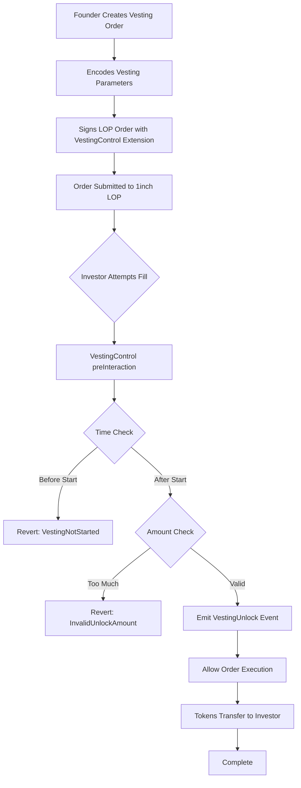

# VestingControl Extension

> **🕰️ Token Vesting for 1inch Limit Order Protocol**  
> Enable token vesting with cliff periods and scheduled unlocks for investor protection

---

## Overview

The **VestingControl Extension** enables token vesting on the 1inch Limit Order Protocol by enforcing time-based unlock schedules with cliff periods. This extension is perfect for projects wanting to vest tokens to investors with:

1. **Cliff Period**: Initial lockup period where no tokens can be claimed
2. **Periodic Unlocks**: Regular intervals where a portion of tokens becomes available
3. **Automatic Enforcement**: Blockchain-enforced vesting schedule that cannot be circumvented

### Example Use Case

A project wants to vest 1,000 tokens to an investor over 12 months:

- **3-month cliff**: No tokens available for 90 days
- **9 monthly unlocks**: After cliff, ~111 tokens unlock every 30 days
- **Investor control**: Investor can claim unlocked tokens when they choose
- **Founder benefits**: Automated distribution without ongoing management

---

## Architecture



### Key Components

- **🕰️ VestingControl**: Core extension implementing time-based unlock validation
- **📦 Stateless Design**: No state storage - all parameters encoded in order extension data
- **🔒 Cliff Protection**: Prevents any unlocks before the cliff period ends
- **📅 Period Enforcement**: Ensures fills respect vesting schedule timing and amounts

---

## Features

### ✅ **Flexible Vesting Schedules**

- Customizable cliff periods (e.g., 90 days)
- Configurable unlock intervals (e.g., monthly, quarterly)
- Any number of unlock periods
- Support for any ERC20 token

### ✅ **Cliff Period Protection**

- Absolute lockup for specified duration
- Cliff period calculated as offset to `startTime`
- No tokens can be unlocked before cliff ends

### ✅ **Automated Period Enforcement**

- Validates unlock amounts don't exceed current period allowance
- Prevents claiming future periods early
- Handles final period rounding automatically

### ✅ **Stateless & Gas Efficient**

- No contract state storage required
- Vesting parameters encoded in order extension data
- Minimal gas overhead for validation

---

## Usage Examples

### 1. Basic Vesting Order (3-month cliff + 9 monthly unlocks)

```javascript
const VestingControl = await ethers.getContractFactory('VestingControl');
const vestingControl = await VestingControl.deploy();

// Vesting parameters
const cliffDuration = 90 * 24 * 60 * 60; // 90 days
const vestingPeriod = 30 * 24 * 60 * 60; // 30 days
const totalPeriods = 9; // 9 monthly unlocks
const startTime = Math.floor(Date.now() / 1000) + cliffDuration; // Start after cliff

// Encode vesting parameters for extension data
const vestingParams = ethers.AbiCoder.defaultAbiCoder().encode(
  ['uint256', 'uint256', 'uint256'],
  [vestingPeriod, totalPeriods, startTime]
);

// Create vesting order
const order = {
  salt: '12345',
  makerAsset: '0x...', // Project token address
  takerAsset: '0x...', // Payment token address (USDC, ETH, etc.)
  maker: founderAddress,
  receiver: '0x0000000000000000000000000000000000000000',
  allowedSender: '0x0000000000000000000000000000000000000000',
  makingAmount: '1000000000000000000000', // 1000 project tokens
  takingAmount: '100000000000000000000', // 100 payment tokens

  makerTraits: encodeMakerTraits({
    allowedSender: false,
    shouldCheckEpoch: false,
    expiry: Math.floor(Date.now() / 1000) + 365 * 24 * 60 * 60, // 1 year
    nonceOrEpoch: 1,
    series: 0,
  }),

  // VestingControl integration
  preInteraction: await vestingControl.getAddress(),
  extension: vestingParams, // Encoded vesting parameters
};
```

---

## Vesting Schedule Examples

### Example 1: Standard Startup Vesting

```javascript
// 1-year cliff, then 3 years monthly vesting (48 months total)
const cliffMonths = 12;
const vestingMonths = 36;
const startTime = now + cliffMonths * 30 * 24 * 60 * 60;

const params = encodeVestingParams({
  vestingPeriod: 30 * 24 * 60 * 60, // 30 days
  totalPeriods: vestingMonths, // 36 periods
  startTime: startTime, // After 1-year cliff
});
```

### Example 2: Investor Protection Schedule

```javascript
// 3-month cliff, then quarterly unlocks for 2 years
const cliffDuration = 90 * 24 * 60 * 60; // 90 days
const quarterlyPeriod = 90 * 24 * 60 * 60; // 90 days
const quarters = 8; // 2 years

const params = encodeVestingParams({
  vestingPeriod: quarterlyPeriod,
  totalPeriods: quarters,
  startTime: now + cliffDuration,
});
```

### Example 3: Gradual Release Schedule

```javascript
// No cliff, weekly unlocks for 1 year
const weeklyPeriod = 7 * 24 * 60 * 60; // 7 days
const weeks = 52; // 1 year

const params = encodeVestingParams({
  vestingPeriod: weeklyPeriod,
  totalPeriods: weeks,
  startTime: Math.floor(Date.now() / 1000), // Start immediately
});
```

---

## Integration Guide

### 1. Deploy VestingControl

```bash
# Using Hardhat
npx hardhat run scripts/deploy-vesting-control.js --network mainnet

# Using Hardhat Ignition
npx hardhat ignition deploy ignition/modules/VestingControl.js --network mainnet
```

### 2. Create Vesting Orders

```javascript
// Frontend helper function
function createVestingOrder(
  projectToken,
  paymentToken,
  projectAmount,
  paymentAmount,
  founderAddress,
  vestingSchedule
) {
  // Encode vesting parameters
  const vestingParams = ethers.AbiCoder.defaultAbiCoder().encode(
    ['uint256', 'uint256', 'uint256'],
    [
      vestingSchedule.vestingPeriod,
      vestingSchedule.totalPeriods,
      vestingSchedule.startTime,
    ]
  );

  return {
    makerAsset: projectToken,
    takerAsset: paymentToken,
    makingAmount: projectAmount,
    takingAmount: paymentAmount,
    maker: founderAddress,

    // Extension configuration
    preInteraction: vestingControlAddress,
    extension: vestingParams,

    // Standard LOP fields...
  };
}
```

### 3. Monitor Vesting Events

```javascript
// Listen for vesting unlock events
vestingControl.on('VestingUnlock', (taker, amount, period, timestamp) => {
  console.log(`Vesting unlock: ${ethers.formatEther(amount)} tokens`);
  console.log(`Period: ${period}, Timestamp: ${new Date(timestamp * 1000)}`);

  // Update UI, send notifications, etc.
  updateVestingDashboard(taker, amount, period);
});
```

---

## Technical Specifications

### Vesting Parameters Structure

```solidity
struct VestingParams {
    uint256 vestingPeriod;  // Seconds between each unlock
    uint256 totalPeriods;   // Number of unlock periods
    uint256 startTime;      // When vesting begins (after cliff)
}
```

### Parameter Encoding

```javascript
// Manual encoding (matches contract expectations)
const vestingParams = ethers.AbiCoder.defaultAbiCoder().encode(
  ['uint256', 'uint256', 'uint256'],
  [vestingPeriod, totalPeriods, startTime]
);
```

### Time Calculations

```javascript
// Current period calculation
const timeSinceStart = block.timestamp - startTime;
const currentPeriod = Math.floor(timeSinceStart / vestingPeriod) + 1;

// Amount available for current period
const amountPerPeriod = totalAmount / totalPeriods;
const shouldBeVested = Math.min(currentPeriod * amountPerPeriod, totalAmount);
const availableAmount = shouldBeVested - alreadyClaimed;
```

---

## Security Considerations

### ✅ **Time-Based Security**

- Uses `block.timestamp` for all time checks
- Cliff periods cannot be bypassed
- Period boundaries strictly enforced

### ✅ **Amount Validation**

- Prevents claiming more than allocated per period
- Handles rounding in final period correctly
- Validates against total vesting amount

### ✅ **Stateless Design Benefits**

- No contract state to manipulate
- Parameters immutably encoded in order
- Reduced attack surface

### ⚠️ **Risk Factors**

- **Miner Timestamp Manipulation**: Limited impact due to period granularity
- **Front-running**: Investors may compete to claim unlocked tokens first
- **Parameter Errors**: Incorrect encoding could lock tokens permanently

---

## Testing

### Unit Tests

```bash
# Run VestingControl tests
npx hardhat test test/extensions/VestingControl.test.js

# Run integration tests
npx hardhat test test/extensions/VestingControl.integration.test.js
```

### Test Coverage

```bash
# Generate coverage report
npx hardhat coverage --testfiles "test/extensions/VestingControl*.test.js"

# Key test scenarios:
# ✅ Parameter encoding/decoding
# ✅ Time-based validation (before/after cliff)
# ✅ Amount validation (per-period limits)
# ✅ Multi-period progression
# ✅ Final period rounding
# ✅ Error conditions and edge cases
```

---

## Troubleshooting

### Common Issues

#### **"VestingNotStarted" Error**

- Occurs when trying to fill an order before the vesting start time
- Check that `block.timestamp >= startTime` where `startTime` includes cliff duration

#### **"InvalidUnlockAmount" Error**

- Occurs when trying to claim more than allowed for current period
- Ensure `makingAmount <= totalAmount / totalPeriods` per transaction
- Verify sufficient time has passed for the requested unlock amount

#### **"VestingAlreadyCompleted" Error**

- Occurs when all tokens have been claimed (`remainingMakingAmount == 0`)
- Check order status before attempting additional fills

#### **Parameter Encoding Issues**

```javascript
// ✅ Correct encoding format
const params = ethers.AbiCoder.defaultAbiCoder().encode(
  ['uint256', 'uint256', 'uint256'], // Exactly 3 uint256 values
  [vestingPeriod, totalPeriods, startTime]
);

// ❌ Common mistakes
// - Wrong types: ['uint', 'uint', 'uint']
// - Wrong order: [startTime, vestingPeriod, totalPeriods]
// - Missing values: [vestingPeriod, totalPeriods]
```

---

## Roadmap

### 🔄 **Future Enhancements**

#### **v2.0 - Advanced Vesting**

- Non-linear vesting schedules (accelerated, cliff-heavy)
- Multiple cliff periods with different unlock rates
- Percentage-based unlocks instead of time-based

#### **v2.1 - Governance Integration**

- DAO-controlled vesting parameter updates
- Emergency pause functionality
- Beneficiary address changes

#### **v2.2 - Multi-Token Vesting**

- Batch vesting for multiple token types
- Proportional vesting across token portfolios
- Cross-chain vesting coordination

---

## Support

### 📞 **Get Help**

- **Documentation**: [1inch Limit Order Protocol Docs](https://docs.1inch.io)
- **Discord**: [1inch Community](https://discord.gg/1inch)
- **GitHub**: [Issues & Feature Requests](https://github.com/1inch/limit-order-protocol)

### 🤝 **Contributing**

1. Fork the repository
2. Create feature branch: `git checkout -b feature/vesting-enhancement`
3. Implement changes with comprehensive tests
4. Update documentation
5. Submit Pull Request

---

**🕰️ VestingControl Extension - Bringing Trust and Transparency to Token Distribution**
