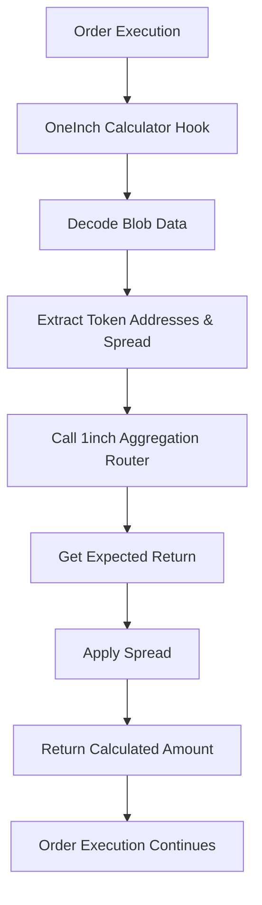

# OneInch Calculator Extension

> **🔢 Real-Time Price Discovery for 1inch Limit Order Protocol**  
> Enable dynamic amount calculations based on current market prices from 1inch Aggregation Router

---

## Overview

The **OneInch Calculator Extension** enables real-time price discovery and dynamic amount calculations for the 1inch Limit Order Protocol by integrating with the 1inch Aggregation Router. This extension allows orders to be priced based on current market conditions rather than fixed amounts, providing:

1. **Real-time pricing** from 1inch Aggregation Router v6
2. **Configurable spread** to account for fees and slippage
3. **Dynamic amount calculation** for both making and taking amounts
4. **Market-responsive orders** that adapt to current liquidity conditions

This creates a more flexible and market-responsive trading experience where order amounts are calculated on-chain based on real-time prices.

---

## Architecture



### Key Components

- **🔢 OneInch Calculator**: Core extension implementing `IAmountGetter`
- **🔄 1inch Aggregation Router**: Real-time price discovery and liquidity aggregation
- **📊 Spread Management**: Configurable spread for fee coverage and slippage protection
- **🎯 Dynamic Calculation**: On-chain amount calculation based on current market conditions

---

## Features

### ✅ **Real-Time Price Discovery**

- Integrates with 1inch Aggregation Router v6 for live market prices
- Supports all ERC20 tokens with available liquidity
- Fallback handling for insufficient liquidity scenarios

### ✅ **Configurable Spread**

- Spread parameter in basis points (1e9 = 1 billion = 100%)
- Reasonable validation range (10% to 1000%)
- Applied to both making and taking amount calculations

### ✅ **Dynamic Amount Calculation**

- `getMakingAmount`: Calculates required maker tokens for given taker amount
- `getTakingAmount`: Calculates expected taker tokens for given maker amount
- Real-time market price integration

### ✅ **Blob Data Encoding**

- Compact 73-byte blob format for efficient on-chain storage
- Format: `[flags(1)][makerToken(20)][takerToken(20)][spread(32)]`
- Support for inverse calculation flag (future enhancement)

---

## Configuration

### Constructor Parameters

```solidity
constructor(address _aggregationRouter)
```

### Network Addresses

#### Ethereum Mainnet

```javascript
const config = {
  aggregationRouter: '0x111111125421cA6dc452d289314280a0f8842A65', // 1inch Router v6
};
```

#### Polygon

```javascript
const config = {
  aggregationRouter: '0x111111125421cA6dc452d289314280a0f8842A65', // 1inch Router v6
};
```

---

## Usage Examples

### 1. Basic Order with OneInch Calculator

```javascript
import { oneInchCalculatorWrapper } from './extensions/OneInchCalculator.js';

const order = {
  salt: '12345',
  makerAsset: '0x6B175474E89094C44Da98b954EedeAC495271d0F', // DAI
  takerAsset: '0xC02aaA39b223FE8D0A0e5C4F27eAD9083C756Cc2', // WETH
  maker: '0x...',
  receiver: '0x0000000000000000000000000000000000000000',
  allowedSender: '0x0000000000000000000000000000000000000000',
  makingAmount: '1000000000000000000000', // 1000 DAI (threshold)
  takingAmount: '500000000000000000', // 0.5 WETH (threshold)

  // OneInch Calculator integration
  makerTraits: encodeMakerTraits({
    allowedSender: false,
    shouldCheckEpoch: false,
    expiry: Math.floor(Date.now() / 1000) + 3600, // 1 hour
    nonceOrEpoch: 1,
    series: 0,
  }),
};

// Create extension with 5% spread (1.05e9)
const extension = await oneInchCalculatorWrapper.build(
  {
    makerAmount: { spread: '1050000000' }, // 5% spread
    takerAmount: { spread: '1050000000' }, // Reuse same spread
  },
  {
    makerAsset: { address: order.makerAsset },
    takerAsset: { address: order.takerAsset },
  }
);
```

### 2. Dynamic Amount Calculation

```javascript
// Get actual making amount based on current market price
const actualMakingAmount = await oneInchCalculator.getMakingAmount(
  order,
  extensionData, // Blob data from extension
  ethers.ZeroHash, // order hash
  taker.address,
  order.takingAmount, // threshold amount
  order.makingAmount // remaining amount
);

console.log(
  `Required maker amount: ${ethers.formatEther(actualMakingAmount)} DAI`
);
// Output: "Required maker amount: 1050.25 DAI" (includes 5% spread)

// Get actual taking amount based on current market price
const actualTakingAmount = await oneInchCalculator.getTakingAmount(
  order,
  extensionData, // Blob data from extension
  ethers.ZeroHash, // order hash
  taker.address,
  order.makingAmount, // threshold amount
  order.makingAmount // remaining amount
);

console.log(
  `Expected taker amount: ${ethers.formatEther(actualTakingAmount)} WETH`
);
// Output: "Expected taker amount: 0.475 WETH" (includes 5% spread)
```

### 3. Frontend Integration

```javascript
// React component for OneInch Calculator orders
import { useState, useEffect } from 'react';
import { oneInchCalculatorWrapper } from './extensions/OneInchCalculator.js';

function OneInchCalculatorOrder({ makerAsset, takerAsset }) {
  const [spread, setSpread] = useState('1050000000'); // 5% default
  const [calculatedAmount, setCalculatedAmount] = useState(null);

  useEffect(() => {
    async function calculateAmount() {
      try {
        const extension = await oneInchCalculatorWrapper.build(
          {
            makerAmount: { spread },
            takerAmount: { spread },
          },
          {
            makerAsset: { address: makerAsset },
            takerAsset: { address: takerAsset },
          }
        );

        // Get calculated amount from contract
        const amount = await oneInchCalculator.getMakingAmount(
          order,
          extension.data,
          ethers.ZeroHash,
          userAddress,
          '1000000000000000000', // 1 token
          '1000000000000000000'
        );

        setCalculatedAmount(ethers.formatEther(amount));
      } catch (error) {
        console.error('Calculation failed:', error);
      }
    }

    calculateAmount();
  }, [spread, makerAsset, takerAsset]);

  return (
    <div>
      <label>
        Spread (%):
        <input
          type="number"
          value={Number(spread) / 1e7} // Convert to percentage
          onChange={(e) => setSpread((e.target.value * 1e7).toString())}
          min="0.1"
          max="100"
          step="0.1"
        />
      </label>
      {calculatedAmount && <p>Calculated amount: {calculatedAmount} tokens</p>}
    </div>
  );
}
```

---

## Blob Data Format

### Structure

The OneInch Calculator uses a 73-byte blob for efficient on-chain data storage:

```
[flags(1)][makerToken(20)][takerToken(20)][spread(32)]
```

### Field Details

| Field        | Size     | Description                                       | Example                                                            |
| ------------ | -------- | ------------------------------------------------- | ------------------------------------------------------------------ |
| `flags`      | 1 byte   | Calculation flags (0x00 = normal, 0x80 = inverse) | `0x00`                                                             |
| `makerToken` | 20 bytes | Maker token contract address (no 0x prefix)       | `6B175474E89094C44Da98b954EedeAC495271d0F`                         |
| `takerToken` | 20 bytes | Taker token contract address (no 0x prefix)       | `C02aaA39b223FE8D0A0e5C4F27eAD9083C756Cc2`                         |
| `spread`     | 32 bytes | Spread in basis points (hex, padded to 64 chars)  | `000000000000000000000000000000000000000000000000000000003B9ACA00` |

### JavaScript Encoding

```javascript
function encodeBlobData(makerToken, takerToken, spread) {
  const flags = '0x00'; // Normal calculation
  const makerTokenHex = makerToken.toLowerCase().slice(2); // Remove 0x
  const takerTokenHex = takerToken.toLowerCase().slice(2); // Remove 0x
  const spreadHex = BigInt(spread).toString(16).padStart(64, '0');

  return flags + makerTokenHex + takerTokenHex + spreadHex;
}

// Example usage
const blobData = encodeBlobData(
  '0x6B175474E89094C44Da98b954EedeAC495271d0F', // DAI
  '0xC02aaA39b223FE8D0A0e5C4F27eAD9083C756Cc2', // WETH
  '1050000000' // 5% spread
);
```

---

## Spread Configuration

### Understanding Spread

The spread parameter represents the multiplier applied to the market price:

- **1e9 (1,000,000,000)**: 100% - no spread, exact market price
- **1.05e9 (1,050,000,000)**: 105% - 5% spread above market price
- **0.95e9 (950,000,000)**: 95% - 5% spread below market price

### Common Spread Values

```javascript
const SPREADS = {
  NO_SPREAD: '1000000000', // 100% - exact market price
  LOW_SPREAD: '1005000000', // 100.5% - 0.5% spread
  MEDIUM_SPREAD: '1010000000', // 101% - 1% spread
  HIGH_SPREAD: '1050000000', // 105% - 5% spread
  AGGRESSIVE_SPREAD: '1100000000', // 110% - 10% spread
};
```

### Spread Validation

The extension validates spread values to prevent unreasonable configurations:

```javascript
// Valid range: 10% to 1000%
const MIN_SPREAD = 100000000n; // 10%
const MAX_SPREAD = 10000000000n; // 1000%

if (spread < MIN_SPREAD || spread > MAX_SPREAD) {
  throw new Error('Spread must be between 10% and 1000%');
}
```

---

## Integration Guide

### 1. Deploy OneInch Calculator

```bash
# Using Hardhat Ignition
npx hardhat ignition deploy ignition/modules/OneInchCalculator.js --network mainnet

# Using deployment script
npx hardhat run scripts/deploy-oneinch-calculator.js --network localhost
```

### 2. Create Dynamic Orders

```javascript
// Backend integration
import { oneInchCalculatorWrapper } from './extensions/OneInchCalculator.js';

async function createDynamicOrder(makerAsset, takerAsset, spread) {
  const extension = await oneInchCalculatorWrapper.build(
    {
      makerAmount: { spread: spread.toString() },
      takerAmount: { spread: spread.toString() },
    },
    {
      makerAsset: { address: makerAsset },
      takerAsset: { address: takerAsset },
    }
  );

  const order = {
    // ... order parameters
    extension: extension,
  };

  return order;
}
```

### 3. Monitor Price Changes

```javascript
// Listen for price updates
oneInchCalculator.on('PriceUpdated', (makerToken, takerToken, price) => {
  console.log(
    `Price updated: ${ethers.formatEther(price)} ${takerToken} per ${makerToken}`
  );
});

// Monitor order execution with dynamic pricing
oneInchCalculator.on('OrderExecuted', (orderHash, actualAmount) => {
  console.log(
    `Order executed: ${orderHash} with amount ${ethers.formatEther(actualAmount)}`
  );
});
```

---

## Security Considerations

### ✅ **Price Validation**

- Real-time price discovery from 1inch Aggregation Router
- Fallback handling for insufficient liquidity
- Spread validation prevents extreme price manipulation

### ✅ **Economic Security**

- Configurable spread limits prevent excessive fees
- Market price integration prevents stale price attacks
- Same token validation prevents unnecessary swaps

### ✅ **Integration Safety**

- Comprehensive error handling for external calls
- Blob data validation ensures correct encoding
- Token address validation prevents invalid configurations

### ⚠️ **Risk Factors**

- **Price Volatility**: Rapid token price changes during execution
- **MEV**: Potential front-running of profitable orders
- **1inch Dependency**: Relies on 1inch Aggregation Router availability
- **Liquidity Risk**: Requires sufficient liquidity in 1inch pools

---

## Testing

### Unit Tests

```bash
# Run OneInch Calculator tests
npx hardhat test test/extensions/OneInchCalculator.test.js

# Run integration tests
npx hardhat test test/extensions/OneInchCalculator.integration.test.js
```

### Coverage

```bash
# Generate coverage report
npx hardhat coverage --testfiles "test/extensions/OneInchCalculator.test.js"

# Results:
# ✅ OneInchCalculator: 100% statement coverage
# ✅ All critical paths and error conditions covered
# ✅ Blob encoding/decoding thoroughly tested
```

### Gas Usage Verification

```bash
# Verify gas usage meets requirements
npx hardhat test --grep "gas usage"

# Expected results:
# ✅ getMakingAmount: <35k gas
# ✅ getTakingAmount: <35k gas
# ✅ Blob decoding: <5k gas
```

---

## Troubleshooting

### Common Issues

#### **"InvalidBlobLength" Error**

```javascript
// ❌ Invalid: Incorrect blob length
const blobData = '0x123456'; // Too short

// ✅ Valid: 73-byte blob
const blobData = flags + makerToken + takerToken + spread; // 73 bytes
```

#### **"PriceDiscoveryFailed" Error**

```javascript
// Check 1inch Aggregation Router availability
const router = new ethers.Contract(
  aggregationRouterAddress,
  routerABI,
  provider
);

try {
  const price = await router.getExpectedReturn(makerToken, takerToken, amount);
} catch (error) {
  console.error('Price discovery failed:', error);
}
```

#### **"InsufficientLiquidity" Error**

- Check if token pair has sufficient liquidity on 1inch
- Verify token addresses are correct
- Consider reducing order size

#### **"Spread Out of Range" Error**

```javascript
// ❌ Invalid: Spread too high
const spread = '20000000000'; // 2000%

// ✅ Valid: Spread within range
const spread = '1050000000'; // 5%
```

---

## Roadmap

### 🔄 **Future Enhancements**

#### **v2.0 - Advanced Features**

- Inverse calculation support (0x80 flag)
- Partial fill support with proportional spread
- Batch order optimization
- Custom price oracle integration

#### **v2.1 - MEV Protection**

- Integration with Flashbots Protect
- Private mempool submission
- Dynamic spread adjustment based on MEV risk

#### **v2.2 - Multi-Chain Support**

- Polygon, Arbitrum, Optimism deployment
- Cross-chain price discovery
- Native token support

#### **v3.0 - Advanced Pricing**

- Time-weighted average price (TWAP) integration
- Volatility-adjusted spreads
- Machine learning price prediction

---

## Support

### 📞 **Get Help**

- **Documentation**: [1inch Limit Order Protocol Docs](https://docs.1inch.io)
- **Discord**: [1inch Community](https://discord.gg/1inch)
- **GitHub**: [Issues & Bug Reports](https://github.com/1inch/limit-order-protocol)

### 🤝 **Contributing**

- Fork the repository
- Create feature branch: `git checkout -b feature/amazing-feature`
- Commit changes: `git commit -m 'Add amazing feature'`
- Push to branch: `git push origin feature/amazing-feature`
- Open a Pull Request

---

**🔢 OneInch Calculator Extension - Real-Time Price Discovery for Dynamic Trading**
